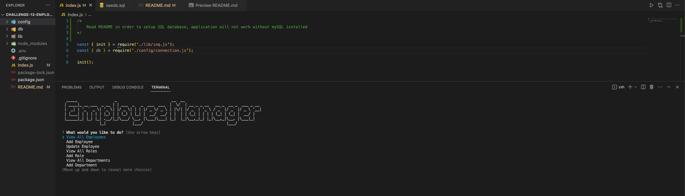

# Challenge 12 Employee Tracker

## Description 
  A command line application that allows the user to view and manage the departments, roles, and employees in a companies database. The application utilizes Node.js, mySQL2, inuquirer,

## Table of Contents
  
  - [Description](#description)
  - [Installation](#installation)
  - [Usage](#usage)
  - [License](#license)
  - [Questions](#questions)

## Installation
  Setup the sql enviroment. 
  Make a .env file or enter server credentials in connections.js in the config directory.
  If the .env file is used, it will need 3 credentials, *replace* with your own credentials. 
    <pre>
    DB_HOST = "*localhost*"
    DB_USER = "*root*"
    DB_PASSWORD = "*yourpassword*"
    </pre>

  To initialize open the mySQL CLI tool with the command
    <pre>
    mysql -u '*root*' -p
    </pre>

  Once in the mySQL shell use the command
    
    source db/schema.sql

  If exmaple seed data is wanted use command

    source db/seeds.sql

  Exit the mySQL shell with

    exit

  Install the npm packages with

    npm install

## Usage
  Run the application by using

    npm start
  
  In the command line

  

## License
  This application is licensed under the [MIT](https://choosealicense.com/licenses/mit/) license
  
## Questions
  Created by: [cgwol](https://github.com/cgwol/)
  
  Contact with any further questions at [cgwalterson@icloud.com](mailto:cgwalterson@icloud.com)
  
## Video 
  [Video Link](https://drive.google.com/file/d/1_CbnLjRjQ8gBcyfV07OavLRZHnXqDk5Z/view?usp=sharing "Video Link")